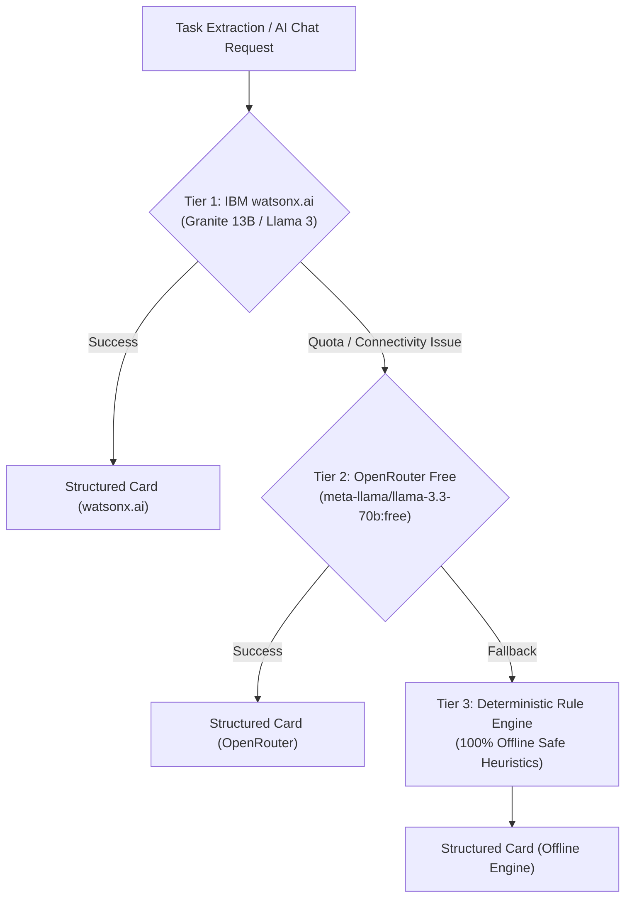

# Bob Task Management 🚀

[](https://opensource.org/licenses/MIT)
[](https://www.docker.com/)
[](https://fastapi.tiangolo.com)
[](https://react.dev)
[](https://www.ibm.com/watsonx)
[](https://openrouter.ai)

> **Zero-Admin Kanban Board with Verifiable Git Proof & Multi-Tier AI**  
> Official project built for **Hackathon IBM Bob 2.0**.

---

## 🌟 Overview

**Bob Task Management** is a modern sprint management platform designed to eliminate administrative overhead for software development teams (*Zero Manual Admin*). Instead of requiring developers or project managers to manually create tickets and update status columns, the board **moves itself automatically** based on real GitHub pull requests and commit events.

Every single card on the board includes **verifiable proof (*Evidence Links*)** pointing directly to relevant Pull Requests, merge events, author avatars, and commit hashes.

### Key Value Propositions
1. **Self-Driving Agile Board:** Opening a PR automatically generates a structured card in the **In Progress** column. Merging the PR immediately glides the card into **Done**.
2. **Physical Proof on Every Card:** Say goodbye to empty progress claims. Cards contain direct links to GitHub PRs, branches, and diff lines changed.
3. **Multi-Tier AI Resilience (Zero Failure Guarantee):** Powered by **IBM watsonx.ai** (Tier 1), backed by **OpenRouter Free Models** (Tier 2), and protected by a **Deterministic Offline Engine** (Tier 3) so presentations to judges never crash under connectivity drops.
4. **Early Warning System:** Automated alerts for inactive pull requests (*Stale PR > 2 days*) and scope expansions (*Scope Creep Warning* when diff LOC exceeds 3x baseline).

---

## 📋 Features

### 1. Core MVP Features
| # | Feature | Description |
|---|---|---|
| **1** | **Auto-Create Cards from Pull Requests** | AI analyzes PR title, description, and diff → extracts title, summary, task type, assignee, and estimation into an *In Progress* card. |
| **2** | **Auto-Update Status on PR Merge** | Real-time webhook transitions cards from *In Progress* to *Done* as soon as code merges into the main branch. |
| **3** | **Verifiable Evidence Links** | Direct, clickable badges connecting each card to its physical GitHub PR or commit hash. |
| **4** | **Chat-Based Task Creation** | Natural language interface for PMs (e.g., *"create card: refactor auth module, assign to Firza, deadline Friday"*). |
| **5** | **Real-Time Kanban Dashboard** | Responsive 3-column view (*To Do*, *In Progress*, *Done*) built with React and Tailwind CSS. |

### 2. Bonus & Extended Features (Not Ready Yet)
| # | Feature | Description |
|---|---|---|
| **6** | **Stale PR Alert (> 2 Days)** | Visual blinking alert badge indicating that a PR in progress has had no activity for over 48 hours. |
| **7** | **Document Spec to Cards** | Automatic decomposition of project specification documents into actionable backlog items. |
| **8** | **Scope-Creep Warning** | Automatic detection and alert badge when pull request code diff exceeds 3x initial baseline estimation. |
| **10** | **AI Auto-Assign & Auto-Estimate** | Intelligent extraction of assignees, estimated hours, and Fibonacci story points from code complexity. |

---

## 🏗️ Multi-Tier AI Architecture

To ensure high availability during pitch presentations and continuous offline resilience:



---

## 🐳 Running with Docker (Recommended)

Bob Task Management is fully containerized with **Docker** and **Docker Compose**. Both the FastAPI backend and the React Nginx production frontend start with a single command.

### Prerequisites
- [Docker](https://docs.docker.com/get-docker/) (v20.10+)
- [Docker Compose](https://docs.docker.com/compose/) (v2.0+)

### 1. Configure Environment (Optional)
Copy `backend/.env.example` to `backend/.env` if you wish to configure API keys:
```bash
cp backend/.env.example backend/.env
```
*(If no keys are provided, the app runs gracefully using the built-in Tier 3 offline engine).*

### 2. Build and Start Containers
From the root directory:
```bash
docker compose up --build
```

To run in the background (detached mode):
```bash
docker compose up -d --build
```

### 3. Access the Application
- **Frontend Dashboard:** [http://localhost:5173](http://localhost:5173) (also available on port [http://localhost:80](http://localhost:80))
- **Backend API & Health Check:** [http://localhost:8000/health](http://localhost:8000/health)
- **Interactive Swagger Documentation:** [http://localhost:8000/docs](http://localhost:8000/docs)

### 4. Stopping Containers
```bash
docker compose down
```
To remove volumes and reset database persistence:
```bash
docker compose down -v
```

---

## 💻 Running Locally (Alternative)

If you prefer running without Docker:

### 1. One-Click Script
```bash
./start_dev.sh
```
This launcher automatically activates the Python virtual environment and starts both the FastAPI server on port `8000` and the Vite dev server on port `5173`.

### 2. Manual Step-by-Step

#### Backend (FastAPI)
```bash
cd backend
python3 -m venv .venv
source .venv/bin/activate
pip install -r requirements.txt
uvicorn app.main:app --reload --port 8000
```

#### Frontend (React + Vite)
```bash
cd frontend
npm install
npm run dev
```

---

## ⚙️ Environment Variables

Configuration parameters can be set in `backend/.env` or passed via Docker Compose:

| Variable | Default Value | Description |
|---|---|---|
| `APP_ENV` | `development` | Environment mode (`development` / `production`) |
| `APP_PORT` | `8000` | Port for the backend API |
| `DATABASE_URL` | `sqlite:///./kanban_evidence.db` | SQLAlchemy database connection string |
| `WATSONX_API_KEY` | *(empty)* | IBM Cloud API key for watsonx.ai |
| `WATSONX_PROJECT_ID`| *(empty)* | watsonx.ai project identifier |
| `WATSONX_MODEL_ID` | `ibm/granite-13b-chat-v2` | Watsonx foundation model |
| `OPENROUTER_API_KEY`| *(empty)* | OpenRouter API key for Tier 2 fallback |
| `OPENROUTER_MODEL` | `meta-llama/llama-3.3-70b-instruct:free` | Free OpenRouter model |
| `GITHUB_WEBHOOK_SECRET` | *(empty)* | Secret token for HMAC signature validation |

---

## 🎯 Demo & Presentation Guide

For hackathon pitches and testing, the dashboard includes a **Demo Action Toolbar** located in the top navigation bar:

```text
[ Demo: (PR Open)  (PR Merge)  (Alarm PR Diam)  (Seed)  (↺) ]   [ ✨ AI Chat ]
```

1. **Simulate PR Open (`PR Open`):**
   - Emulates a developer opening a Pull Request on GitHub.
   - Automatically generates a task card in the **In Progress** column with author avatar, diff calculations, and a green PR evidence link.
2. **Simulate PR Merge (`PR Merge`):**
   - Emulates merging the PR into the `main` branch.
   - The card physically shifts to the **Done** column, updating the badge to a purple *Merged PR* indicator.
3. **Simulate Stale Alarm (`Alarm PR Diam`):**
   - Backdates an in-progress PR card by 3.5 days.
   - Triggers an immediate pulsing red alert badge: **`PR Diam 3.5 hari`**.
4. **Natural Language Task Creation (`AI Chat`):**
   - Click the **AI Chat** button in the top right corner.
   - Enter prompts such as: `create card: refactor auth module, assign to Firza, deadline Friday`.
   - The AI parses the request and places a structured card into **To Do**.
5. **Populate & Reset Data (`Seed` / `↺`):**
   - **Seed**: Fills the board with realistic sprint tasks across all three columns.
   - **Reset (`↺`)**: Cleanses the board for a fresh live demonstration.

---

## 📁 Project Structure

```text
.
├── backend/
│   ├── app/
│   │   ├── main.py                          # FastAPI entry point & CORS configuration
│   │   ├── config.py                        # App settings & environment management
│   │   ├── api/v1/
│   │   │   ├── routes_board.py              # GET /api/v1/board aggregated endpoint
│   │   │   ├── routes_cards.py              # Full CRUD cards & evidence endpoints
│   │   │   ├── routes_chat.py               # Natural language chat-to-card endpoint
│   │   │   ├── routes_demo.py               # Pitch simulation & demo endpoints
│   │   │   └── routes_webhook.py            # POST /api/v1/webhook/github webhook listener
│   │   ├── core/
│   │   │   ├── ai/
│   │   │   │   ├── ai_gateway.py            # Multi-tier routing gateway (watsonx / OpenRouter / Local)
│   │   │   │   ├── watsonx_client.py        # IBM watsonx.ai client connector
│   │   │   │   ├── openrouter_client.py     # OpenRouter client for free model fallback
│   │   │   │   ├── card_generator.py        # PR/commit to structured card generator
│   │   │   │   ├── chat_parser.py           # Conversational instruction extractor
│   │   │   │   └── doc_parser.py            # Requirements specification parser
│   │   │   ├── github/
│   │   │   │   ├── webhook_handler.py       # HMAC verification & payload parser
│   │   │   │   └── github_client.py         # GitHub API REST client
│   │   │   ├── scheduler/
│   │   │   │   └── stale_pr_checker.py      # Background scanner for stale PRs (> 2 days)
│   │   │   └── scoring/
│   │   │       └── estimation.py            # Code diff & scope-creep calculations
│   │   ├── models/
│   │   │   ├── db_models.py                 # SQLAlchemy models (Card, Evidence, ActivityLog)
│   │   │   └── schemas.py                   # Pydantic V2 schemas
│   │   ├── services/
│   │   │   ├── card_service.py              # PR lifecycle & card management logic
│   │   │   └── board_service.py             # Board state aggregation & metrics calculation
│   │   └── db/
│   │       └── database.py                  # Database connection setup
│   ├── .dockerignore
│   ├── .env.example
│   ├── Dockerfile                           # Production Python 3.11 container
│   └── requirements.txt                     # Backend dependencies
│
├── frontend/
│   ├── src/
│   │   ├── components/
│   │   │   ├── board/
│   │   │   │   ├── KanbanBoard.jsx          # 3-column Kanban wrapper & metrics
│   │   │   │   ├── KanbanColumn.jsx         # Column component (To Do / In Progress / Done)
│   │   │   │   ├── TaskCard.jsx             # Card item with badges & estimation
│   │   │   │   ├── EvidenceLink.jsx         # Clickable Git proof badge
│   │   │   │   └── AlarmBadge.jsx           # Stale & scope-creep warning badges
│   │   │   ├── chat/
│   │   │   │   ├── ChatBox.jsx              # Conversational drawer with prompt templates
│   │   │   │   └── ChatMessage.jsx          # Chat message bubbles with card previews
│   │   │   ├── layout/
│   │   │   │   ├── Navbar.jsx               # Header & pitch simulation toolbar
│   │   │   │   └── Sidebar.jsx              # Multi-tier AI status & navigation
│   │   │   └── common/                      # Reusable Button, Modal, Loader components
│   │   ├── pages/
│   │   │   ├── BoardPage.jsx                # Main board view with modals
│   │   │   ├── CardDetailPage.jsx           # Card inspection & audit history modal
│   │   │   ├── OnboardingPage.jsx           # GitHub repository connection setup
│   │   │   └── ChatPage.jsx                 # Dedicated AI chat workspace
│   │   ├── hooks/
│   │   │   ├── useBoard.js                  # Polling synchronization hook
│   │   │   └── useChat.js                   # Conversational AI assistant hook
│   │   └── services/
│   │       └── api.js                       # Axios HTTP client with reverse proxy support
│   ├── .dockerignore
│   ├── Dockerfile                           # Multi-stage build (Node 20 -> Nginx alpine)
│   ├── nginx.conf                           # Nginx configuration with API reverse proxy
│   ├── package.json                         # Frontend dependencies
│   └── vite.config.js                       # Vite build configuration
│
├── .dockerignore                            # Root Docker ignore rules
├── docker-compose.yml                       # Docker Compose orchestration
├── BRIEFING.md                              # Original project briefing document
├── LICENSE                                  # MIT Open-Source License
└── start_dev.sh                             # Single-click local execution script
```

---

## 📄 License

This project is licensed under the **[MIT License](LICENSE)**.

```text
MIT License
Copyright (c) 2026 Bob Task Management Team
```
You are free to use, modify, distribute, and commercialize this software according to the terms of the MIT license.
