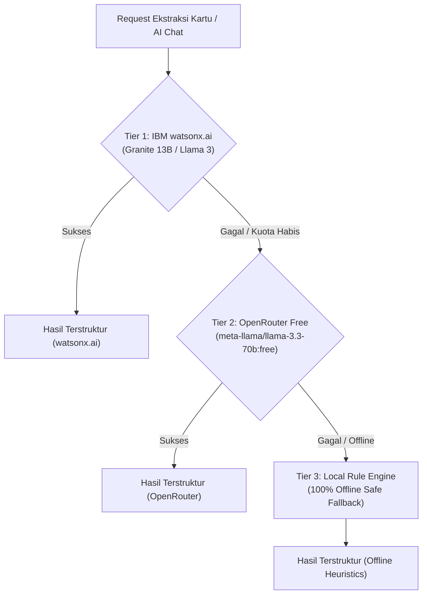

# Bob Task Management 🚀

[](https://opensource.org/licenses/MIT)
[](https://fastapi.tiangolo.com)
[](https://react.dev)
[](https://www.ibm.com/watsonx)
[](https://openrouter.ai)

> **Zero-Admin Kanban Board with Verifiable Proof & Multi-Tier AI**  
> Proyek Resmi untuk **Hackathon IBM Bob 2.0**.

---

## 🌟 Tentang Bob Task Management

**Bob Task Management** adalah platform manajemen sprint modern yang menghilangkan beban administratif developer dan manajer proyek (*Zero Manual Admin*). Board Kanban ini secara otomatis bergerak sendiri berdasarkan aktivitas Git aktual, dilengkapi **tautan bukti fisik (*Evidence Links*)** ke setiap Pull Request dan commit GitHub terkait.

### Nilai Utama (Value Proposition)
1. **Papan yang Update Sendiri (*Self-Driving Board*):** Saat developer membuka PR, kartu otomatis terbuat di kolom *In Progress*. Saat PR di-merge, kartu otomatis meluncur ke kolom *Done*.
2. **Setiap Kartu Punya Bukti Fisik:** Tidak ada lagi klaim progress kosong. Setiap kartu tertaut langsung ke nomor PR, status merge, branch, dan hash commit GitHub.
3. **Multi-Tier AI Resilience:** Ditenagai oleh **IBM watsonx.ai** (Tier 1), dengan **OpenRouter Free Model Fallback** (Tier 2), serta **Deterministic Offline Engine** (Tier 3) agar presentasi ke juri **100% tahan banting (Zero Failure Guarantee)**.
4. **Early Warning System:** Alarm otomatis jika ada PR yang mandek (*Stale PR > 2 hari*) atau jika ukuran diff melebihi estimasi awal (*Scope Creep Warning*).

---

## 📋 Fitur Utama

### 1. Fitur Wajib (Core MVP)
| # | Fitur | Deskripsi |
|---|---|---|
| **1** | **Auto-Create Kartu dari PR Baru** | AI membaca commit/deskripsi PR → membuat kartu tugas otomatis (judul, deskripsi, assignee, tipe task, estimasi) di kolom *In Progress*. |
| **2** | **Auto-Update Status Kartu** | Saat PR di-merge ke branch utama, webhook memicu kartu otomatis berpindah ke *Done*. |
| **3** | **Tautan Bukti Fisik (*Evidence Links*)** | Badge interaktif di setiap kartu yang mengarah langsung ke PR dan commit GitHub. |
| **4** | **Chat-Based Task Creation** | PM dapat membuat kartu via chat bahasa sehari-hari (contoh: *"buat kartu: refactor auth module, assign ke Firza"*). |
| **5** | **Dashboard Kanban Board** | Tampilan visual 3 kolom (*To Do*, *In Progress*, *Done*) dengan Tailwind CSS dan real-time synchronization. |

### 2. Fitur Tambahan (Bonus Features)
| # | Fitur | Deskripsi |
|---|---|---|
| **6** | **Alarm PR Diam > 2 Hari** | Indikator visual merah berkedip pada kartu yang PR-nya tidak memiliki aktivitas selama lebih dari 2 hari. |
| **7** | **Dokumen Spec → Kartu Otomatis** | Ekstraksi dokumen spesifikasi proyek menjadi daftar kartu sprint yang modular. |
| **8** | **Scope-Creep Warning** | Peringatan otomatis jika ukuran diff kode melampaui 3x estimasi awal. |
| **10** | **AI Auto-Assign & Auto-Estimate** | Ekstraksi otomatis developer assignee, jam pengerjaan, dan Fibonacci story points. |

---

## 🏗️ Arsitektur Multi-Tier AI

Untuk memastikan aplikasi selalu bekerja saat demo panggung tanpa bergantung sepenuhnya pada satu provider:



---

## 🚀 Panduan Memulai (Quick Start)

### Prasyarat
- Python 3.10+
- Node.js 18+ dan npm

### 1. Jalankan Sekali Klik
```bash
./start_dev.sh
```
Script ini akan otomatis mengaktifkan virtual environment backend FastAPI di port `8000` dan server frontend Vite di port `5173`.

### 2. Atau Jalankan Secara Manual

#### **Backend (FastAPI)**
```bash
cd backend
source .venv/bin/activate
uvicorn app.main:app --reload --port 8000
```
- API Health & Status: [http://localhost:8000/health](http://localhost:8000/health)
- Interactive Swagger UI: [http://localhost:8000/docs](http://localhost:8000/docs)

#### **Frontend (React + Vite)**
```bash
cd frontend
npm install
npm run dev
```
- Dashboard App: [http://localhost:5173](http://localhost:5173)

---

## ⚙️ Konfigurasi Environment (`backend/.env`)

Salin file `backend/.env.example` ke `backend/.env`:

```env
APP_ENV=development
APP_HOST=0.0.0.0
APP_PORT=8000
DATABASE_URL=sqlite:///./kanban_evidence.db

# IBM watsonx.ai (Tier 1 AI)
WATSONX_API_KEY=your_ibm_cloud_api_key_here
WATSONX_PROJECT_ID=your_watsonx_project_id_here
WATSONX_URL=https://us-south.ml.cloud.ibm.com
WATSONX_MODEL_ID=ibm/granite-13b-chat-v2
WATSONX_USE_FALLBACK_ON_ERROR=true

# OpenRouter Fallback (Tier 2 AI - Free Model Fallback)
OPENROUTER_API_KEY=your_openrouter_api_key_here
OPENROUTER_MODEL=meta-llama/llama-3.3-70b-instruct:free

# GitHub Webhook
GITHUB_WEBHOOK_SECRET=your_github_webhook_secret_here
GITHUB_ACCESS_TOKEN=your_github_token_here
```

> [!TIP]
> Jika API key dikosongkan, aplikasi tetap **berjalan 100% normal** menggunakan mesin *Tier 3 Deterministic Engine*, sehingga Anda bisa langsung mendemokannya tanpa setup API key sekalipun!

---

## 🎯 Panduan Skenario Pengujian & Pitch Demo

Di header dashboard terdapat **Demo Toolbar** khusus presentasi:

1. **Simulate PR Open (`PR Open`):**
   - Mensimulasikan developer membuka PR di repo.
   - Kartu otomatis muncul di kolom **In Progress** dengan badge link PR hijau dan estimasi otomatis.
2. **Simulate PR Merge (`PR Merge`):**
   - Mensimulasikan PR di-merge ke main.
   - Kartu langsung meluncur sendiri ke kolom **Done** dan badge berubah menjadi ungu (*Merged PR*).
3. **Simulate Alarm PR Diam (`Alarm PR Diam`):**
   - Memundurkan waktu kartu di *In Progress* menjadi 3.5 hari yang lalu.
   - Badge alarm merah berkedip langsung menyala di kartu (*PR Diam > 2 hari*).
4. **Bikin Kartu via Chat (`AI Chat`):**
   - Buka drawer chat di kanan atas.
   - Ketik: `buat kartu: refactor auth module, assign ke Firza, deadline Jumat`.
   - AI mengekstrak data dan kartu langsung masuk ke kolom **To Do**.
5. **Populate & Reset Data (`Seed` / `↺`):**
   - Tombol **Seed** memuat data sprint realistis.
   - Tombol **Reset** mengosongkan papan untuk memulai demo baru.

---

## 📁 Struktur Folder Project

```text
.
├── backend/
│   ├── app/
│   │   ├── main.py                          # Entry point FastAPI & CORS
│   │   ├── config.py                        # Konfigurasi env & settings
│   │   ├── api/v1/
│   │   │   ├── routes_board.py              # Endpoint GET /board
│   │   │   ├── routes_cards.py              # CRUD Kartu & Evidence
│   │   │   ├── routes_chat.py               # AI Chat task parser
│   │   │   ├── routes_demo.py               # Pitch Demo Simulator
│   │   │   └── routes_webhook.py            # POST /webhook/github
│   │   ├── core/
│   │   │   ├── ai/
│   │   │   │   ├── ai_gateway.py            # Multi-tier router (watsonx -> OpenRouter -> Local)
│   │   │   │   ├── watsonx_client.py        # Koneksi ke IBM watsonx.ai
│   │   │   │   ├── openrouter_client.py     # Fallback ke OpenRouter (Model gratis)
│   │   │   │   ├── card_generator.py        # Generator kartu dari PR/commit
│   │   │   │   ├── chat_parser.py           # Parser instruksi teks ke kartu
│   │   │   │   └── doc_parser.py            # Parser spesifikasi dokumen
│   │   │   ├── github/
│   │   │   │   ├── webhook_handler.py       # Validasi signature & parse payload
│   │   │   │   └── github_client.py         # GitHub REST API client
│   │   │   ├── scheduler/
│   │   │   │   └── stale_pr_checker.py      # Pengecek PR diam >2 hari
│   │   │   └── scoring/
│   │   │       └── estimation.py            # Estimasi SP & Scope-creep detector
│   │   ├── models/
│   │   │   ├── db_models.py                 # Model SQLAlchemy (Card, Evidence, ActivityLog)
│   │   │   └── schemas.py                   # Schema Pydantic V2
│   │   ├── services/
│   │   │   ├── card_service.py              # Logika bisnis siklus PR & kartu
│   │   │   └── board_service.py             # Agregasi data kolom & statistik
│   │   └── db/
│   │       └── database.py                  # Engine SQLite / PostgreSQL
│   ├── requirements.txt
│   ├── .env.example
│   └── Dockerfile
│
├── frontend/
│   ├── src/
│   │   ├── components/
│   │   │   ├── board/
│   │   │   │   ├── KanbanBoard.jsx          # Papan 3 kolom
│   │   │   │   ├── KanbanColumn.jsx         # Kolom To Do / In Progress / Done
│   │   │   │   ├── TaskCard.jsx             # Kartu tugas
│   │   │   │   ├── EvidenceLink.jsx         # Badge link ke PR/commit
│   │   │   │   └── AlarmBadge.jsx           # Badge alarm PR diam / scope-creep
│   │   │   ├── chat/
│   │   │   │   ├── ChatBox.jsx              # AI Chat drawer
│   │   │   │   └── ChatMessage.jsx          # Bubble chat dengan preview kartu
│   │   │   ├── layout/
│   │   │   │   ├── Navbar.jsx               # Header & Demo Action Toolbar
│   │   │   │   └── Sidebar.jsx              # Status AI Engine & Navigasi
│   │   │   └── common/                      # Button, Modal, Loader
│   │   ├── pages/
│   │   │   ├── BoardPage.jsx                # Halaman utama Kanban
│   │   │   ├── CardDetailPage.jsx           # Modal detail kartu & audit log
│   │   │   ├── OnboardingPage.jsx           # Panduan hubungkan repo
│   │   │   └── ChatPage.jsx                 # AI Chat workspace penuh
│   │   ├── hooks/
│   │   │   ├── useBoard.js                  # Polling data real-time (3 detik)
│   │   │   └── useChat.js                   # Hook interaksi AI chat
│   │   └── services/
│   │       └── api.js                       # Axios HTTP client
│   ├── package.json
│   └── vite.config.js
│
├── BRIEFING.md                              # Dokumen briefing asli tim
├── LICENSE                                  # Lisensi Open-Source MIT
└── start_dev.sh                             # Launcher sekali klik
```

---

## 📄 Lisensi (License)

Proyek ini dilisensikan di bawah **[MIT License](LICENSE)**.

```text
MIT License
Copyright (c) 2026 Bob Task Management Team
```
Bebas digunakan, dimodifikasi, dan didistribusikan untuk keperluan hackathon, riset, maupun komersial.
